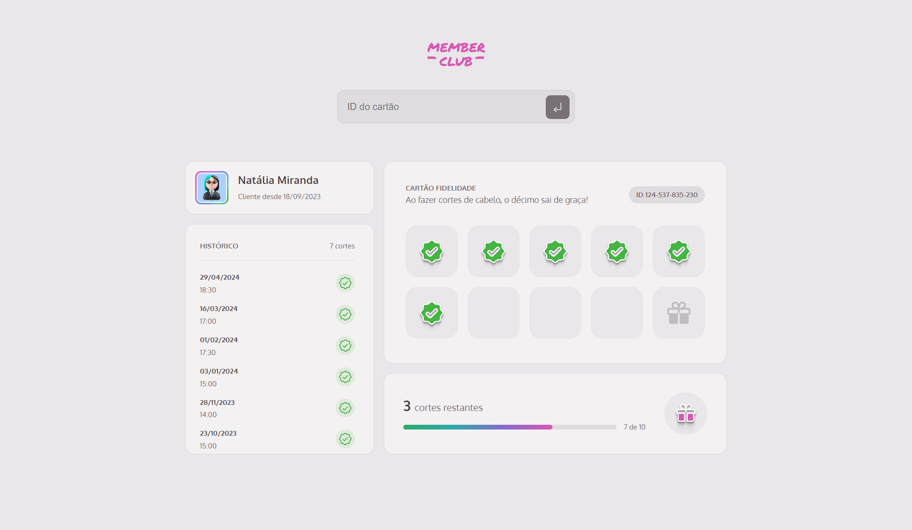
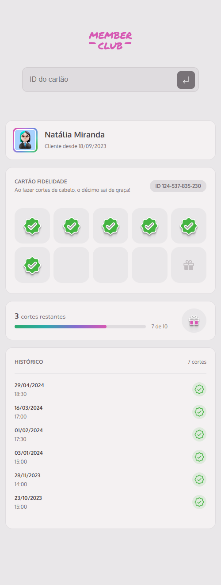

# Members Club - Plataforma de Membros de Salão de Cabeleireiro

## Sobre o Projeto

O **Members Club** é uma aplicação web para gerenciamento de membros de um salão de cabeleireiro. A plataforma permite buscar um membro pelo seu ID e exibir informações detalhadas como:

- Nome do membro
- Data de ingresso no clube
- Histórico de cortes de cabelo
- Selos conquistados
- Quantidade de selos faltantes para um corte de cabelo grátis

Este projeto foi desenvolvido utilizando **HTML**, **CSS** e **JavaScript**, com foco na simplicidade e funcionalidade.

## Funcionalidades

- Buscar membros pelo ID
- Alerta de erro quando não encontra ID
- Exibir histórico de cortes e selos conquistados
- Contagem de selos para corte grátis
- Interface responsiva, compatível com web e mobile

## Screenshots

### Visão Web



### Visão Mobile



## Como executar o projeto

Siga os passos abaixo para clonar e executar a aplicação localmente.

### Pré-requisitos

- [Node.js](https://nodejs.org/) instalado em sua máquina

### Passos para execução

1. **Clone o repositório:**
  ```bash
   git clone https://github.com/saramargarido/members-club.git
  ```

2. **Navegue até o diretório do projeto:**

   ```bash
   cd members-club
   ```

3. **Instale as dependências:**
 
   ```bash
   npm install
   ```

4. **Inicie o servidor:**

   O servidor será necessário para fornecer os dados dos membros.

   ```bash
   npm run server
   ```

5. **Inicie a aplicação:**

   Para rodar a aplicação em ambiente de desenvolvimento.

   ```bash
   npm run dev
   ```

6. **Acesse no navegador:**
 
   Após iniciar, a aplicação estará disponível no seguinte endereço:

   ```
   http://localhost:3000
   ```

**Dica:**
 
   Visualize os clientes mockados pesquisando esses IDs:

   ```
   1
   ```
   ```
   124-537-835-230
   ```
   ```
   207-245-699-104
   ```
   ```
   523-114-876-908
   ```

## Tecnologias Utilizadas

- HTML5
- CSS3
- JavaScript (ES6+)
- Node.js

## Estrutura do Projeto

```bash
├── src/                   # Código-fonte principal
│   ├── index.html         # HTML principal
│   ├── main.js            # Importa os módulos do Javascript
│   ├── assets/            # Arquivos de imagem
│   ├── libs/              # Códigos que acessam as bibliotecas utilizadas
│   ├── modules/           # Módulos do JavaScript
│   ├── services/          # Acesso à API/servidor via fetch
│   ├── styles/            # Arquivos de estilo CSS
├── server.json            # Arquivo Json que simula o retorno da base de dados
├── package.json           # Dependências e scripts NPM
├── webpack.config.js      # Configuração do Webpack
├── README.md              # Documentação do projeto
```


